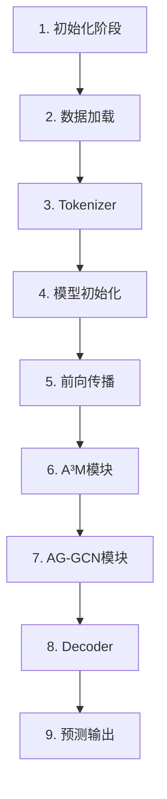

# AoM代码执行顺序与数据维度变化详解

> 本文档按照代码实际运行顺序，逐行分析数据维度在各模块间的传递和变换过程。

---

## 📊 执行流程概览



---

## 1. 初始化阶段 (MAESC_training.py)

### 1.1 环境参数初始化

```python
# MAESC_training.py: 20-50
parser.add_argument('--dataset', default='twitter15')
parser.add_argument('--batch_size', default=16)
parser.add_argument('--max_len', default=10)
...

args = parser.parse_args()
```

**数据维度变化**: 无

---

## 2. 数据加载阶段 (dataset.py)

### 2.1 数据集初始化

```python
# dataset.py: __init__方法
def __init__(self, examples, tokenizer, args, mode='train'):
    self.examples = examples  # List[Example对象]
    self.tokenizer = tokenizer
    self.args = args
    self.mode = mode
```

**数据维度变化**:
```
输入: examples = [ex1, ex2, ..., exN]  # N个样本
输出: self.examples = List[Example]    # [N]
```

### 2.2 批处理数据准备

```python
# dataset.py: __getitem__方法
def __getitem__(self, index):
    example = self.examples[index]

    # 1. 处理文本token
    input_ids = example.input_ids  # List[int]

    # 2. 处理图像特征
    image_features = example.image_features  # List[List[float]]

    # 3. 处理标签
    labels = example.labels  # List[int]

    # 4. 创建mask
    mask = example.mask  # List[int]

    return {
        'input_ids': torch.tensor(input_ids, dtype=torch.long),
        'image_features': image_features,
        'labels': torch.tensor(labels, dtype=torch.long),
        'mask': torch.tensor(mask, dtype=torch.long),
    }
```

**数据维度变化**:
```
输入: 一个样本
├── input_ids: [seq_len] = [66]  # 51图像+15文本
├── image_features: [51, 2048]   # 51个图像块，2048维ROI特征
├── labels: [target_len]         # 目标序列长度
└── mask: [seq_len] = [66]       # 注意力掩码

输出: 一个批次 (batch_size=16)
input_ids: [B, 66]
image_features: [B, 51, 2048]
labels: [B, target_len]
mask: [B, 66]
```

---

## 3. Tokenizer初始化 (tokenization_new.py)

### 3.1 Tokenizer类初始化

```python
# tokenization_new.py: __init__方法
def __init__(self, args):
    self._base_tokenizer = BartTokenizer.from_pretrained(args.bart_model)
    self.sentinet_on = args.sentinet_on

    # 加载SenticNet词典
    if self.sentinet_on:
        path = os.path.join(os.path.dirname(__file__), '../senticnet_word.txt')
        self.senticNet = {}
        fp = open(path, 'r')
        for line in fp:
            word, sentic = line.split('\t')
            self.senticNet[word] = sentic
```

**数据维度变化**:
```
输入: args (配置参数)
输出: self.senticNet = {word: sentic_score}
      维度: Dict[str, str] = 大约10,000个词条
```

---

## 4. 模型初始化 (MAESC_model.py)

### 4.1 模型构建

```python
# MAESC_model.py: build_model方法
def build_model(self, args, bart_model, tokenizer, label_ids, config):
    # 加载BART预训练模型
    model = BartModel.from_pretrained(bart_model)

    # 调整词表大小
    model.resize_token_embeddings(len(tokenizer.unique_no_split_tokens) + num_tokens)

    # 创建多模态编码器
    multimodal_encoder = MultiModalBartEncoder(config, encoder, ...)

    return (multimodal_encoder, decoder)
```

**数据维度变化**:
```
输入: bart_model权重
输出: 多模态模型
      - encoder: BART编码器
      - decoder: BART解码器
      - 所有线性层: 初始化为[768, 768]
```

### 4.2 损失函数初始化

```python
# MAESC_model.py: 初始化部分
self.senti_linear = nn.Linear(768, 768)         # W_S
self.context_linear = nn.Linear(768, 768)      # W_context
self.noun_linear = nn.Linear(768, 768)         # W_CA
self.multi_linear = nn.Linear(768, 768)        # W_H
self.att_linear = nn.Linear(768*2, 1)          # W_α
self.alpha_linear1 = nn.Linear(768, 768)       # W_1
self.alpha_linear2 = nn.Linear(768, 768)       # W_2
self.linear = nn.Linear(768*2, 1)              # W_β
```

**数据维度变化**:
```
无数据流动，仅参数维度:
所有Linear层权重初始化为:
- 输入768维 → 输出768维: [768, 768]
- 输入1536维 → 输出1维: [1, 1536]
- 输入1维 → 输出768维: [768, 1]
```

---

## 5. 前向传播准备阶段

### 5.1 输入数据准备

```python
# MAESC_model.py: prepare_state方法
def prepare_state(self, input_ids, image_features, attention_mask, ...):
    # 分离图像和文本部分
    img_ids = input_ids[:, :51]    # 图像token IDs
    text_ids = input_ids[:, 51:]   # 文本token IDs

    # noun_mask: 标识哪些位置是名词
    # sentiment_value: 文本token的情感分数
```

**数据维度变化**:
```
输入: input_ids: [B, 66]
输出:
├── img_ids: [B, 51]
├── text_ids: [B, 15]
├── img_features: [B, 51, 2048]
└── text_features: [B, 15]
```

### 5.2 编码器前向传播

```python
# MAESC_model.py: prepare_state方法
dict = self.encoder(
    input_ids=input_ids,
    image_features=image_features,
    attention_mask=attention_mask,
    output_hidden_states=True,
    return_dict=True)

encoder_outputs = dict.last_hidden_state  # [B, 66, 768]
hidden_states = dict.hidden_states        # List[Tensors]
```

**数据维度变化**:
```
输入:
├── input_ids: [B, 66]
├── image_features: [B, 51, 2048]
└── attention_mask: [B, 66]

输出:
├── encoder_outputs: [B, 66, 768]  # 最后一层隐藏状态
└── hidden_states: List[13层]       # 每层: [B, 66, 768]
```

---

## 6. A³M模块执行 (noun_attention方法)

### 6.1 名词特征提取 (get_noun_embed)

```python
# MAESC_model.py: get_noun_embed
noun_mask = noun_mask.cpu()
noun_num = [x.numpy().tolist().count(1) for x in noun_mask]
noun_position = [np.where(np.array(x)==1)[0].tolist() for x in noun_mask]

max_noun_num = max(noun_num)
noun_position = torch.tensor(noun_position).to(self.mydevice)
noun_embed = torch.zeros(feature.shape[0], max_noun_num, feature.shape[-1]).to(self.mydevice)

for i in range(len(feature)):
    noun_embed[i] = torch.index_select(feature[i], dim=0, index=noun_position[i])
```

**数据维度变化**:
```
输入:
├── feature (encoder_outputs): [B, 66, 768]
└── noun_mask: [B, 66]  # 标识名词位置

处理过程:
noun_mask → noun_position: [B, 15] (只保留文本部分名词位置)
noun_position → [B, max_noun_num] (padding到最大长度)

输出: noun_embed: [B, L, 768]
     其中L = max_noun_num (每个batch的最大名词数)
```

### 6.2 A³M注意力计算 (mode='cat')

```python
# MAESC_model.py: noun_attention方法
# 步骤1: 特征复制扩展
multi_features_rep = encoder_outputs.unsqueeze(2).repeat(1, 1, noun_embed.shape[1], 1)
# [B, 66, 768] → [B, 66, 1, 768] → [B, 66, L, 768]

noun_features_rep = noun_embed.unsqueeze(1).repeat(1, encoder_outputs.shape[1], 1, 1)
# [B, L, 768] → [B, 1, L, 768] → [B, 66, L, 768]

# 步骤2: 线性变换
noun_features_rep = self.noun_linear(noun_features_rep)  # W_CA
# [B, 66, L, 768] → [B, 66, L, 768]

multi_features_rep = self.multi_linear(multi_features_rep)  # W_H
# [B, 66, L, 768] → [B, 66, L, 768]

# 步骤3: 特征拼接
concat_features = torch.tanh(torch.cat([noun_features_rep, multi_features_rep], dim=-1))
# [B, 66, L, 768] + [B, 66, L, 768] → [B, 66, L, 1536]

# 步骤4: 注意力权重计算
att = torch.softmax(self.att_linear(concat_features).squeeze(-1), dim=-1)
# concat_features: [B, 66, L, 1536]
# att_linear: [1, 1536] → [B, 66, L, 1]
# .squeeze(-1): [B, 66, L]
# softmax: [B, 66, L] = α_t

# 步骤5: 方面相关特征
att_features = torch.matmul(att, noun_embed)
# [B, 66, L] @ [B, L, 768] → [B, 66, 768] = h_t^A

# 步骤6: 融合系数
alpha = torch.sigmoid(self.linear(
    torch.cat([self.alpha_linear1(encoder_outputs),
               self.alpha_linear2(att_features)], dim=-1)))
# encoder_outputs: [B, 66, 768]
# alpha_linear1: [B, 66, 768]
# att_features: [B, 66, 768]
# alpha_linear2: [B, 66, 768]
# concat: [B, 66, 1536]
# linear: [1, 1536] → [B, 66, 1]
# sigmoid: [B, 66, 1] = β_t

# 步骤7: 最终对齐特征
alpha = alpha.repeat(1, 1, 768)  # 广播
# [B, 66, 1] → [B, 66, 768]

encoder_outputs = torch.mul(1-alpha, encoder_outputs) + torch.mul(alpha, att_features)
# (1-α) × h_t + α × h_t^A
# [B, 66, 768] = ĥ_t
```

**完整数据维度变化流程**:
```
输入: encoder_outputs: [B, 66, 768]
      noun_embed: [B, L, 768]

步骤1-3: multi_features_rep: [B, 66, L, 768]
         noun_features_rep: [B, 66, L, 768]
         concat_features: [B, 66, L, 1536]

步骤4: att: [B, 66, L]

步骤5: att_features: [B, 66, 768] = h_t^A

步骤6: alpha: [B, 66, 1] → [B, 66, 768]

步骤7: encoder_outputs: [B, 66, 768] = ĥ_t (最终输出)
```

---

## 7. AG-GCN模块执行 (multimodal_GCN方法)

### 7.1 多模态特征分离

```python
# MAESC_model.py: multimodal_GCN
img_feature = encoder_outputs[:, :51, :]  # [B, 51, 768]
text_feature = encoder_outputs[:, 51:, :] # [B, 15, 768]
```

**数据维度变化**:
```
输入: encoder_outputs: [B, 66, 768] = ĥ_t
输出:
├── img_feature: [B, 51, 768]  # 图像特征
└── text_feature: [B, 15, 768]  # 文本特征
```

### 7.2 依赖矩阵初始化

```python
# MAESC_model.py: multimodal_GCN
new_dependency_matrix = torch.zeros([B, 66, 66], dtype=torch.float).to(encoder_outputs.device)
# [B, 66, 66] = D (多模态依赖矩阵)

# 设置对角线为1 (自环)
for i in range(new_dependency_matrix.shape[1]):
    new_dependency_matrix[:, i, i] = 1
```

**数据维度变化**:
```
输出: new_dependency_matrix: [B, 66, 66] = D
```

### 7.3 文本-文本依赖计算

```python
# MAESC_model.py: multimodal_GCN
text_feature_extend1 = text_feature.unsqueeze(1).repeat(1, 15, 1, 1)
text_feature_extend2 = text_feature.unsqueeze(2).repeat(1, 1, 15, 1)
text_sim = torch.cosine_similarity(text_feature_extend1, text_feature_extend2, dim=-1)
# [B, 15, 768] → [B, 15, 15, 768]
# 余弦相似度计算
# 输出: text_sim: [B, 15, 15]

new_dependency_matrix[:, 51:, 51:] = dependency_matrix * text_sim
# [B, 15, 15] 填入D的文本-文本子矩阵
```

**数据维度变化**:
```
输入: text_feature: [B, 15, 768]
过程:
├── text_feature_extend1: [B, 15, 15, 768]
├── text_feature_extend2: [B, 15, 15, 768]
└── text_sim: [B, 15, 15]

输出: D_TT子矩阵: [B, 15, 15]
```

### 7.4 图像-文本依赖计算

```python
# MAESC_model.py: multimodal_GCN
img_feature_extend = img_feature.unsqueeze(2).repeat(1, 1, text_feature.shape[1], 1)
text_feature_extend = text_feature.unsqueeze(1).repeat(1, img_feature.shape[1], 1, 1)
sim = torch.cosine_similarity(img_feature_extend, text_feature_extend, dim=-1)
# [B, 51, 768] → [B, 51, 15, 768]
# [B, 15, 768] → [B, 51, 15, 768]
# 余弦相似度计算
# 输出: sim: [B, 51, 15]

noun_mask = noun_mask[:, 51:].unsqueeze(1).repeat(1, sim.shape[1], 1)
sim = sim * noun_mask  # 只保留名词相关的图像-文本依赖

new_dependency_matrix[:, :51, 51:] = sim  # D_VT
new_dependency_matrix[:, 51:, :51] = torch.transpose(sim, 1, 2)  # D_TV
```

**数据维度变化**:
```
输入: img_feature: [B, 51, 768]
      text_feature: [B, 15, 768]

过程:
├── img_feature_extend: [B, 51, 15, 768]
├── text_feature_extend: [B, 51, 15, 768]
├── sim: [B, 51, 15] (图像-文本相似度)
└── noun_mask: [B, 15] → [B, 51, 15] (过滤)

输出:
├── D_VT子矩阵: [B, 51, 15]
└── D_TV子矩阵: [B, 15, 51]
```

### 7.5 情感特征处理

```python
# MAESC_model.py: multimodal_GCN
# SenticNet情感分数
sentiment_value = nn.ZeroPad2d(padding=(51, 0, 0, 0))(sentiment_value)
# [B, 15] → [B, 66] (左侧填充51个0)

sentiment_value = sentiment_value.unsqueeze(-1)
# [B, 66] → [B, 66, 1]

sentiment_feature = self.senti_value_linear(sentiment_value)
# [B, 66, 1] → senti_value_linear → [B, 66, 768] = s_i
```

**数据维度变化**:
```
输入: sentiment_value: [B, 15] (来自SenticNet)
过程:
├── ZeroPad2d: [B, 15] → [B, 66]
├── unsqueeze: [B, 66] → [B, 66, 1]
└── Linear: [B, 66, 1] @ [768, 1]^T → [B, 66, 768]

输出: sentiment_feature: [B, 66, 768] = s_i
```

### 7.6 情感-语义融合

```python
# MAESC_model.py: multimodal_GCN
context_feature = self.context_linear(encoder_outputs + sentiment_feature)
# encoder_outputs: [B, 66, 768] = ĥ_i
# sentiment_feature: [B, 66, 768] = s_i
# 加法: [B, 66, 768] + [B, 66, 768] = [B, 66, 768]
# Linear: [B, 66, 768] → [B, 66, 768]
```

**数据维度变化**:
```
输入:
├── encoder_outputs: [B, 66, 768]
└── sentiment_feature: [B, 66, 768]

过程: [B, 66, 768] + [B, 66, 768] → [B, 66, 768]
      context_linear: [B, 66, 768] → [B, 66, 768]

输出: context_feature: [B, 66, 768] = h_i^S
```

### 7.7 图卷积计算 (GCN层)

```python
# GCN.py: forward方法
context_feature = self.context_gcn(context_feature, context_dependency_matrix, attention_mask)

# GCN内部实现:
def forward(self, inputs, adj, mask=None):
    # inputs: [B, 66, 768] = h_{i,l-1}^S
    # adj: [B, 66, 66] = new_dependency_matrix

    # 步骤1: 线性变换
    support = torch.matmul(inputs, self.weight)
    # [B, 66, 768] @ [768, 768] → [B, 66, 768]

    # 步骤2: 图卷积
    output = torch.matmul(adj, support)
    # [B, 66, 66] @ [B, 66, 768] → [B, 66, 768]

    # 步骤3: 激活
    output = self.act(output + self.bias)  # ReLU
    # [B, 66, 768] = h_{i,l}^S

    return output
```

**数据维度变化**:
```
输入:
├── context_feature: [B, 66, 768] = h_{i,l-1}^S
└── context_dependency_matrix: [B, 66, 66] = A

GCN层1:
├── support: [B, 66, 768]
└── output: [B, 66, 768] = h_{i,1}^S

GCN层2 (最终输出):
context_gcn_output: [B, 66, 768] = Ĥ^S
```

### 7.8 最终特征融合

```python
# MAESC_model.py: multimodal_GCN
mix_feature = self.gcn_proportion * context_feature + encoder_outputs
# gcn_proportion: 0.5 (默认)
# 0.5 × Ĥ^S + 1.0 × Ĥ = H̃
```

**数据维度变化**:
```
输入:
├── context_feature (GCN输出): [B, 66, 768] = Ĥ^S
└── encoder_outputs: [B, 66, 768] = Ĥ

过程: 0.5 × [B, 66, 768] + 1.0 × [B, 66, 768] → [B, 66, 768]

输出: mix_feature: [B, 66, 768] = H̃
```

---

## 8. Decoder前向传播

### 8.1 解码器输入准备

```python
# modules.py: MultiModalBartDecoder_span
# tokens: [B, tgt_len] (目标序列)

cumsum = tokens.eq(1).flip(dims=[1]).cumsum(dim=-1)
tgt_pad_mask = cumsum.flip(dims=[1]).ne(cumsum[:, -1:])
# [B, tgt_len] (padding mask)
```

**数据维度变化**:
```
输入: tokens: [B, tgt_len]
输出: tgt_pad_mask: [B, tgt_len]
```

### 8.2 BART解码器前向传播

```python
# modules.py: MultiModalBartDecoder_span.forward
dict = self.decoder(input_ids=tokens,
                    encoder_hidden_states=mix_feature,
                    encoder_padding_mask=encoder_pad_mask,
                    decoder_padding_mask=decoder_pad_mask,
                    decoder_causal_mask=self.causal_masks[:tokens.size(1), :tokens.size(1)],
                    return_dict=True)

hidden_state = dict.last_hidden_state
# [B, tgt_len, 768] = h_t^d
```

**数据维度变化**:
```
输入:
├── tokens: [B, tgt_len]
├── mix_feature (encoder输出): [B, 66, 768] = H̃
├── encoder_pad_mask: [B, 66]
├── decoder_pad_mask: [B, tgt_len]
└── causal_mask: [tgt_len, tgt_len]

BART Decoder输出:
└── hidden_state: [B, tgt_len, 768] = h_t^d
```

---

## 9. 预测输出阶段

### 9.1 情感标签预测

```python
# modules.py: MultiModalBartDecoder_span.forward
tag_scores = F.linear(
    hidden_state,
    self.dropout_layer(
        self.decoder.embed_tokens.weight[self.label_start_id:self.label_start_id + 3]))
# hidden_state: [B, tgt_len, 768]
# embed_tokens.weight[label部分]: [3, 768] (POS, NEU, NEG)
# F.linear: [B, tgt_len, 768] @ [3, 768]^T → [B, tgt_len, 3]

logits[:, :, 3:self.src_start_index] = tag_scores
# [B, tgt_len, num_classes] = P(y_t)
```

**数据维度变化**:
```
输入:
├── hidden_state: [B, tgt_len, 768] = h_t^d
└── label_embeddings: [3, 768] (POS, NEU, NEG)

过程: [B, tgt_len, 768] @ [3, 768]^T → [B, tgt_len, 3]

输出: logits: [B, tgt_len, num_classes] = P(y_t)
     其中3个情感类别: POS, NEU, NEG
```

### 9.2 最终输出

```python
# 返回: logits: [B, tgt_len, num_classes]
# 损失计算: CrossEntropyLoss(logits, targets)
```

---

## 完整数据流总结

### 批次数据流动

```
输入批次 (batch_size=B=16):
├── input_ids: [B, 66]
├── image_features: [B, 51, 2048]
└── labels: [B, tgt_len]

编码器输出:
encoder_outputs: [B, 66, 768]

A³M模块:
noun_embed: [B, L, 768]
→ att: [B, 66, L]
→ att_features: [B, 66, 768]
→ alpha: [B, 66, 768]
→ encoder_outputs: [B, 66, 768] = ĥ_t

AG-GCN模块:
img_feature: [B, 51, 768]
text_feature: [B, 15, 768]
→ sim: [B, 51, 15]
→ dependency_matrix: [B, 66, 66]
→ sentiment_feature: [B, 66, 768]
→ context_feature: [B, 66, 768]
→ GCN_output: [B, 66, 768] = Ĥ^S
→ mix_feature: [B, 66, 768] = H̃

解码器输出:
hidden_state: [B, tgt_len, 768] = h_t^d

最终输出:
logits: [B, tgt_len, num_classes] = P(y_t)
```

### 关键维度常数

| 名称 | 值 | 说明 |
|------|----|----|
| B | 16 | 批次大小 |
| seq_len | 66 | 输入序列长度 (51图像+15文本) |
| img_len | 51 | 图像patch数量 |
| text_len | 15 | 文本token数量 |
| hidden_size | 768 | 隐藏层维度 |
| noun_len | L | 名词数量 (动态，最大约10) |
| tgt_len | 10 | 目标序列长度 |
| num_classes | 50265 | 词表大小 |

---

**分析完成时间**: 2025-11-13
**代码执行顺序维度跟踪**: ✅